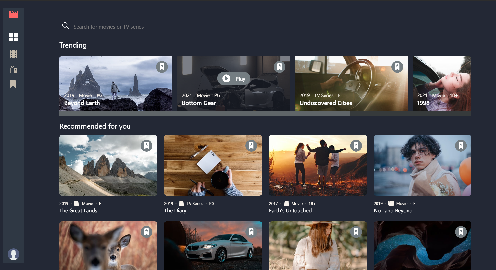

# Frontend Mentor - Entertainment web app solution

This is a solution to the [Entertainment web app challenge on Frontend Mentor](https://www.frontendmentor.io/challenges/entertainment-web-app-J-UhgAW1X). Frontend Mentor challenges help you improve your coding skills by building realistic project.

## Table of contents

- [Installing](#installing)
- [Overview](#overview)
  - [The challenge](#the-challenge)
  - [Screenshot](#screenshot)
  - [Links](#links)
- [My process](#my-process)
  - [Built with](#built-with)
  - [Tests](#tests)

## Installing

```bash
# Clone this repository
$ git clone https://github.com/doniyoraloxanov/Entertainment-web-app.git

# Installing all the dependencies
$ npm install

# Run the app
$ npm start
```

## Overview

### The challenge

Users should be able to:

- View the optimal layout for the app depending on their device's screen size
- See hover states for all interactive elements on the page
- Navigate between Home, Movies, TV Series, and Bookmarked Shows pages
- Add/Remove bookmarks from all movies and TV series
- Search for relevant shows on all pages
- **Bonus**: Build this project as a full-stack application
- **Bonus**: If you're building a full-stack app, we provide authentication screen (sign-up/login) designs if you'd like to create an auth flow

### Screenshot



### Links

- Live Site URL: https://entertainment-web-app-kappa.vercel.app/

## My process

### Built with

- React
- Firebase Authentication
- React Hook Form
- React Router v6
- Tailwind CSS

### Useful resources

- [How to Create Forms in React using react-hook-form](https://www.freecodecamp.org/news/how-to-create-forms-in-react-using-react-hook-form/)
- [React Authentication Tutorial – How to Set Up Auth with Firebase V9 and React Router V6](https://www.freecodecamp.org/news/react-firebase-authentication-and-crud-operations/)
- [How to Use localStorage with React Hooks to Set and Get Items](https://www.freecodecamp.org/news/how-to-use-localstorage-with-react-hooks-to-set-and-get-items/)

## Author

- Website - [www.idoniyor.com](https://www.idoniyor.com)
- Frontend Mentor - [@aloxanovme](https://www.frontendmentor.io/profile/aloxanovme)
